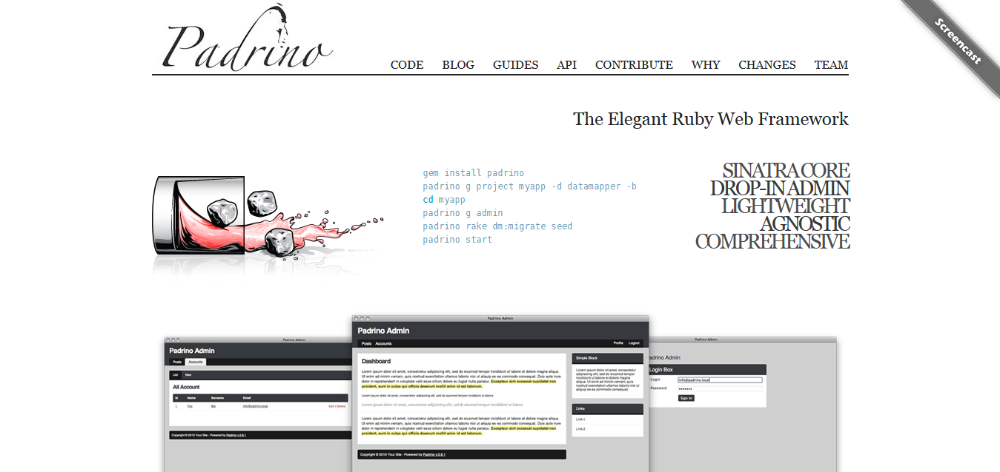
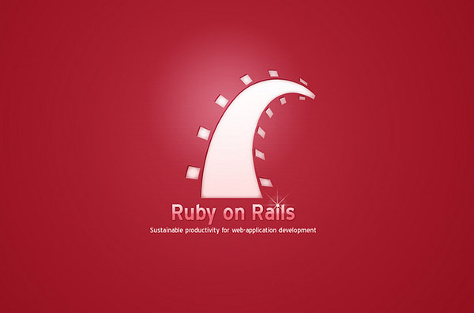

## Introduction to Frameworks

### What is a Web Framework?
You can think of a web framework as a set of tools designed to simplify your work as a developer. Frameworks exist to save you from having to re-invent the wheel and help alleviate some of the overhead when you're building a new site. Typically frameworks provide libraries for accessing a database, managing sessions and cookies, creating templates to display your HTML and in general, promote the reuse of code.

It's important not to confuse a framework with a content management system. While a framework deals with many of the same issues and, in some cases, may make it very easy to build a content management system, a framework is much more general.

Think of a framework as a collection of tools, rather than a specific thing.

### What Can You Do With a Web Framework
Frameworks exist to make building software faster and easier. Typically frameworks provide tools to cover the common CRUD cases. For instance, you'll likely find libraries for accessing a database, managing sessions and cookies, creating templates to display your HTML pages and more.

Frameworks also promote the reuse of code. With a good framework you only need to design, for instance, a contact form once. Then you can drop your generic contact form code into all your projects and save yourself some time and effort.

Nearly any site you’re going to build will have to interact with a database. Frameworks generally offer some means of doing so without having to delve into writing your own SQL every time you want to create, read, update or delete a record.

Similarly, most frameworks either provide a template system, or make it easy to add on your own templating system so that common chunks of HTML that rarely change, for instance, the header and footer of your page, need only be written once.

## Sinatra
Sinatra is a free and open source software web application library and domain-specific language written in Ruby. Designed and developed by Blake Mizerany in 2007, Sinatra is small and flexible. It does not follow the typical model–view–controller pattern used in other frameworks, such as Ruby on Rails. Instead, Sinatra focuses on "quickly creating web-applications in Ruby with minimal effort. 
Some notable companies and institutions that use Sinatra include Apple, BBC, the British Government's Government Digital Service, LinkedIn, the National Security Agency, Engine Yard, Heroku, GitHub and Songbird.
 <small>Source <a href="https://en.wikipedia.org/wiki/Sinatra_(software)">Wikipedia</a></small>

## Padrino
Padrino is a full-stack ruby framework built upon the Sinatra web library. 
Padrino is an open source web application framework, written in Ruby and based on Sinatra.[2][3] It is an alternative to other Ruby web application frameworks such as Ruby on Rails, Merb, Nitro and Camping. It is dependent on the Rack web server interface.

Padrino was created and open-sourced in 2010. The framework was originally created by Nathan Esquenazi, Davide D'Agostino and Arthur Chiu based on the prior sinatra_more gem. The framework was created in order to extend Sinatra to more easily support rich web applications.
 <small>Source 
<a href="http://bit.ly/1TZEhTn"> Wikipedia</a></small>

## Ruby on Rails
Ruby on Rails, or simply Rails, is a web application framework written in Ruby under MIT License. Rails is a model–view–controller (MVC) framework, providing default structures for a database, a web service, and web pages. It encourages and facilitates the use of web standards such as JSON or XML for data transfer, and HTML, CSS and JavaScript for display and user interfacing. In addition to MVC, Rails emphasizes the use of other well-known software engineering patterns and paradigms, including Convention over Configuration (CoC), Don't Repeat Yourself (DRY), and the Active Record pattern.

Some of the biggest and most well known sites on the internet are built with Ruby on Rails. GitHub, Airbnb, Shopify, Twitter (in its early days), Groupon, etc have all used this framework as a building block. See [this blog post](https://prograils.com/posts/top-10-famous-sites-built-with-ruby-on-rails) to find out more.
 <small>Source <a href="https://en.wikipedia.org/wiki/Ruby_on_Rails">Wikipedia</a></small>

## Other frameworks

There are several other frameworks you can use with ruby. Read [this blog post](http://codecondo.com/12-small-ruby-frameworks/) about some of them. 